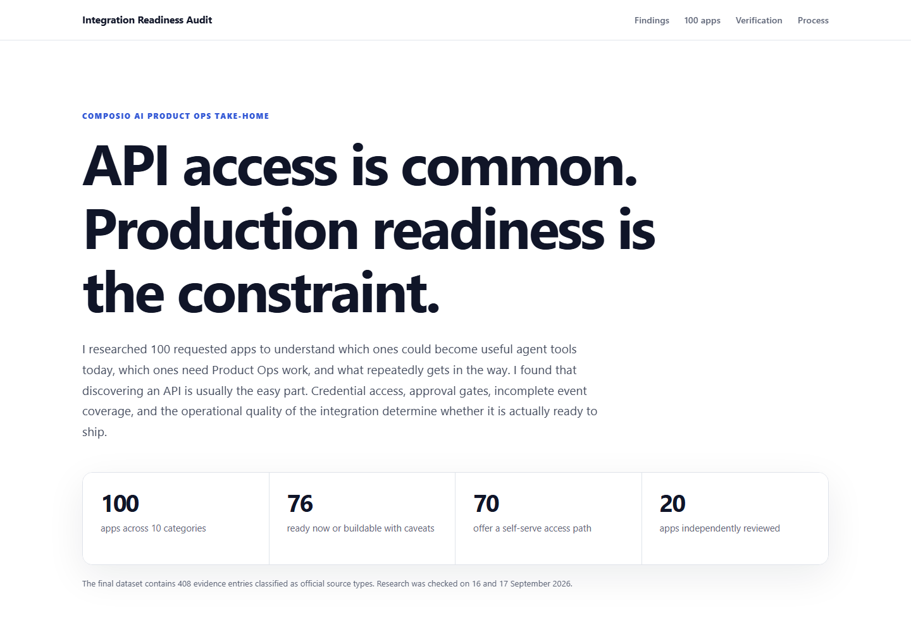
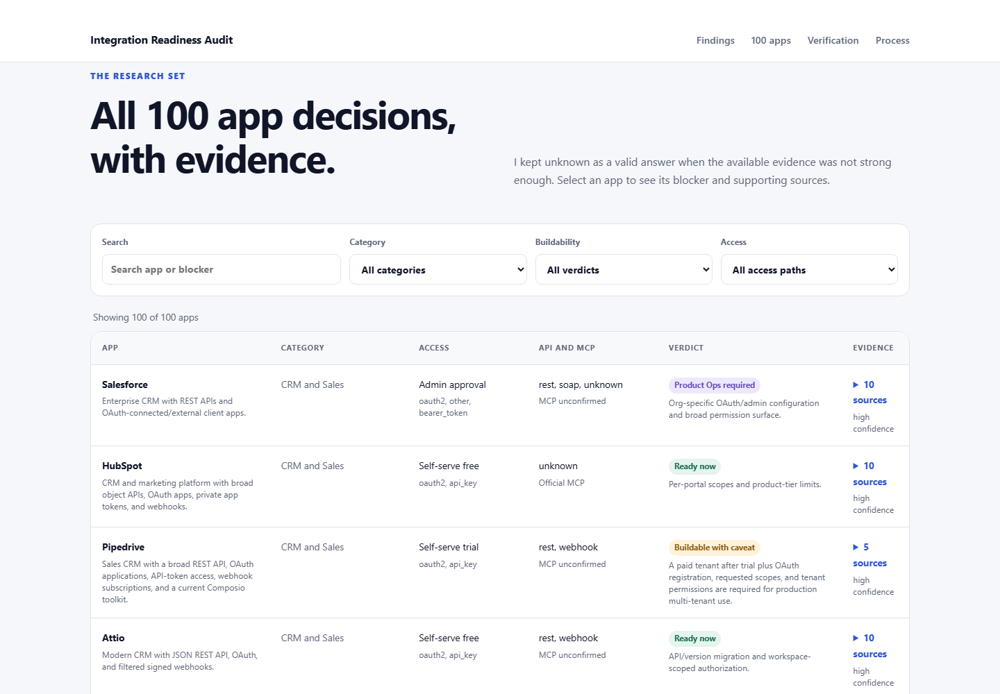

# Composio Integration Readiness Audit

This repository contains my submission for the Composio AI Product Ops take-home assignment. I researched the supplied 100 apps, identified the recurring integration patterns, built a small research runner, and independently reviewed a frozen 20-app sample.





## What is included

- `index.html`, `styles.css`, and `app.js`: the single-page case study.
- `data/apps.json`: the final structured 100-app research set.
- `data/verification_sample.json`: the frozen first pass, second pass, independent reference, and corrected sample fields.
- `research_agent.py`: a small runnable research and validation trigger.
- `score_verification.py`: the deterministic field-level scorer used for the accuracy figures.
- `screenshots/`: reference images of the submitted page.

## Run the case study locally

```bash
python -m http.server 8000
```

Open `http://localhost:8000`.

## Run the research agent

Validate the bundled dataset without an API key:

```bash
python research_agent.py --validate
```

Research one app from the supplied 100-app set with live web search:

```bash
export OPENAI_API_KEY="your-key"
python research_agent.py --app "Notion"
```

On Windows PowerShell, set the key with `$env:OPENAI_API_KEY="your-key"`.

The default research model is `gpt-5.6-luna`. Override it with `--model` if needed. Credentials are read from the environment and are never written to the dataset.

Reproduce the reported verification scores:

```bash
python score_verification.py
```

## Verification method

I froze a 20-app sample before changing the research instructions. It contains two apps per category: one high-risk record and one reproducibly hash-sampled record. A separate official-source review checked ten material fields per app, creating 200 comparisons.

- First pass: 97 of 200 exact field matches, or 48.5%.
- Conservative alias-normalized baseline: 53.5%.
- Second pass: 138 of 200 exact field matches, or 69.0%.
- Improvement: 20.5 percentage points on the same frozen sample.

I then replaced the 20 sampled records with their reviewed versions. The resulting 200 of 200 match is a correction-completeness check for those records, not a claim that all 100 apps were manually verified.

## Scope

The research is time-bound and evidence-led. Paid accounts, vendor outreach, and production credential tests were outside the assignment scope. `unknown` is preserved where official evidence was insufficient.
